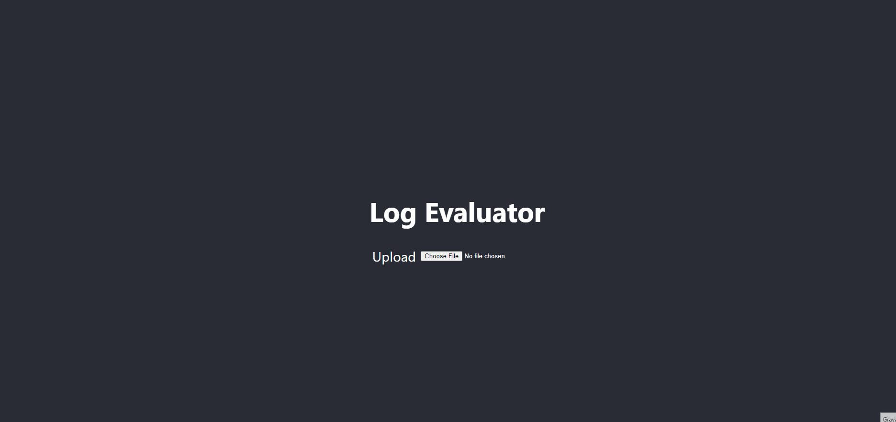
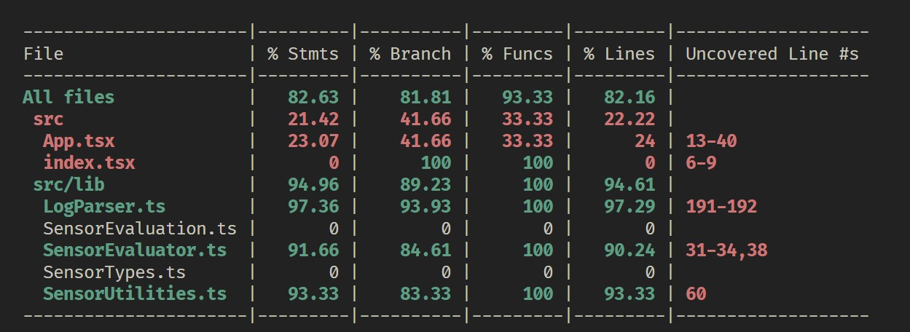

# Quality Control Evaluation Automation for Sensor Logs

This repository provides an automated solution to evaluate sensor logs, ensuring quality control standards are met. It parses and processes sensor readings from log files to categorize the precision and reliability of different types of sensors, including thermometers, humidity sensors, and carbon monoxide detectors.

## Evaluation Criteria:

### 1. **Thermometer**: 
   - **Ultra Precise**: Mean reading is within 0.5 degrees of the known temperature with a standard deviation of less than 3.
   - **Very Precise**: Mean reading is within 0.5 degrees of the room's temperature and has a standard deviation under 5.
   - **Precise**: Does not meet the above conditions.

### 2. **Humidity Sensor**: 
   - The sensor is only acceptable if all its readings are within 1% of the reference humidity value. 

### 3. **Carbon Monoxide Detector**: 
   - The detector is viable only if all its readings are within 3 ppm of the reference value.

The input log begins with reference values for the room's temperature, humidity, and carbon monoxide level. Subsequent entries either identify a specific sensor by type and name or provide a timestamped reading.

Harness this tool to ensure your sensors meet the defined quality standards, providing reliable and accurate data.

#### Data example

```
reference 70.0 45.0 6
thermometer temp-1
2007-04-05T22:00 72.4
2007-04-05T22:01 76.0
2007-04-05T22:02 79.1
2007-04-05T22:03 75.6
2007-04-05T22:04 71.2
2007-04-05T22:05 71.4
2007-04-05T22:06 69.2
2007-04-05T22:07 65.2
2007-04-05T22:08 62.8
2007-04-05T22:09 61.4
2007-04-05T22:10 64.0
2007-04-05T22:11 67.5
2007-04-05T22:12 69.4
thermometer temp-2
2007-04-05T22:01 69.5
2007-04-05T22:02 70.1
2007-04-05T22:03 71.3
2007-04-05T22:04 71.5
2007-04-05T22:05 69.8
humidity hum-1
2007-04-05T22:04 45.2
2007-04-05T22:05 45.3
2007-04-05T22:06 45.1
humidity hum-2
2007-04-05T22:04 44.4
2007-04-05T22:05 43.9
2007-04-05T22:06 44.9
2007-04-05T22:07 43.8
2007-04-05T22:08 42.1
monoxide mon-1
2007-04-05T22:04 5
2007-04-05T22:05 7
2007-04-05T22:06 9
monoxide mon-2
2007-04-05T22:04 2
2007-04-05T22:05 4
2007-04-05T22:06 10
2007-04-05T22:07 8
2007-04-05T22:08 6
```

#### Sample Output

`
{
    "temp-1": "precise",
    "temp-2": "ultra precise",
    "hum-1": "keep",
    "hum-2": "discard",
    "mon-1": "keep",
    "mon-2": "discard"
}`

### Live Demo

https://log-evaluator-example.surge.sh

#### Demo


#### How to use

- Download the files log-text.txt or log.json in the log-files folder
- Upload the file in the demo page to see the results

### Stack

- React
- Typescript
- Javascript
- Jest

### Commands

`yarn install`

`yarn start`

`yarn test`

`yarn test --coverage`

#### Coverage


### Possible Improvements

- Integrate an API.
- Enhance function validations to prevent unexpected behaviors and bolster security.
- Introduce logging for better debugging and maintenance.
- Refactor the parseLogText function for clearer understanding; it currently handles multiple tasks.
- Incorporate real-world examples.
- Enhance error handling in the parse functions.
- Provide examples of how to add new sensors.
- Elaborate on comments related to mathematical evaluations.

### Design Choices

- I developed a React page to visually represent the data, enabling users to import data.
- I introduced the ability to import both JSON and TXT formats.
- I opted to segregate the code into separate files for improved readability, modularity, and easier debugging.
- I added TypeScript to streamline type assurances and reduce errors.
- I included some performance metrics to gauge the most efficient approach JSON or TXT.
- Comprehensive tests were written to confirm expected results and identify edge cases.

### Pitfalls

- I transitioned from having parseReference and parseSensor process the entire array to processing it line by line. However, I observed that this wasn't as performative as I tought, especially with shorter data arrays. Would be better to test with a large file and test the most performatic approach.
- Crafting tests for EvaluateThermometer proved challenging. The mathematical calculations and data interpretations in this context were challenging for me as has been a long time since I have seen it.